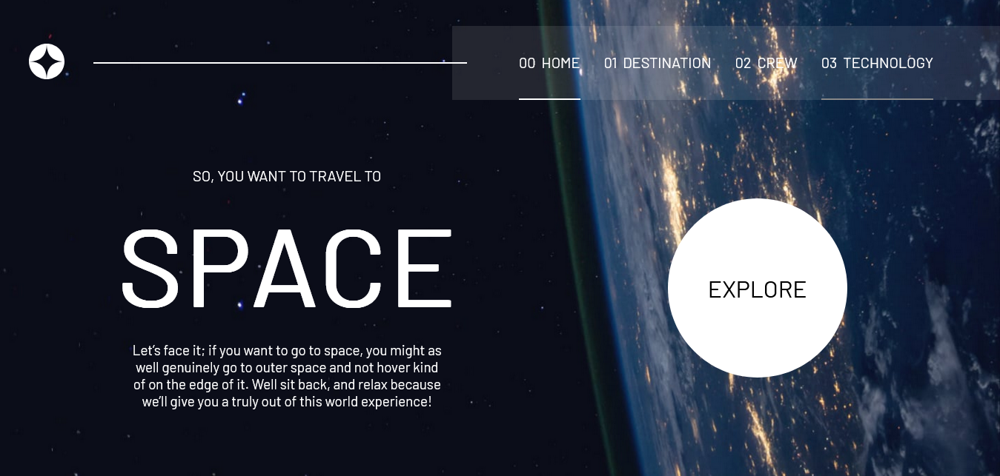

# Frontend Mentor - Space tourism website solution

This is a solution to the [Space tourism website challenge on Frontend Mentor](https://www.frontendmentor.io/challenges/space-tourism-multipage-website-gRWj1URZ3). Frontend Mentor challenges help you improve your coding skills by building realistic projects.

## Table of contents

- [The challenge](#the-challenge)
- [Screenshot](#screenshot)
- [Links](#links)
- [Built with](#built-with)
- [Continued development](#continued-development)
- [Author](#author)

### The challenge

Users should be able to:

- View the optimal layout for each of the website's pages depending on their device's screen size
- See hover states for all interactive elements on the page
- View each page and be able to toggle between the tabs to see new information

### Screenshot

### Links

- Solution URL: [Add solution URL here](https://github.com/jossyboy2580/space-tourism)
- Live Site URL: [Add live site URL here](https://jossyboy2580.github.io/space-tourism)

### Built with

- Semantic HTML5 markup
- Flexbox
- Mobile-first workflow

### Continued development

Well, for one i'd like to point out that it took me a while to complete this task and i guess i need to work on my working ethics.

I noticed the project could make use of a little bit of transitions and animations, fetching and displaying those data from the json file is not really smooth

## Author

- Website - [Joseph Ajobiewe](https://www.your-site.com)
- Frontend Mentor - [@jossyboy2580](https://www.frontendmentor.io/profile/jossyboy2580)
- Twitter - [@jossyboy2580](https://www.twitter.com/jossyboy2580)
